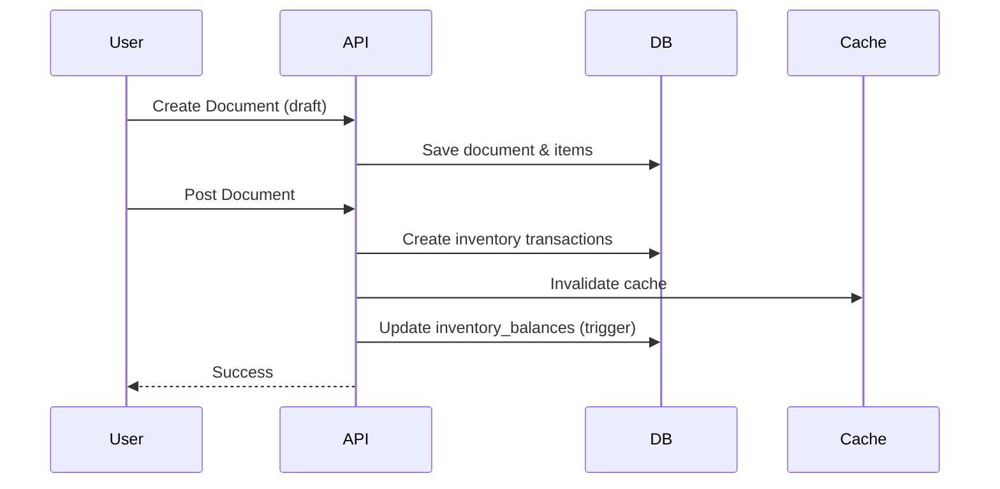
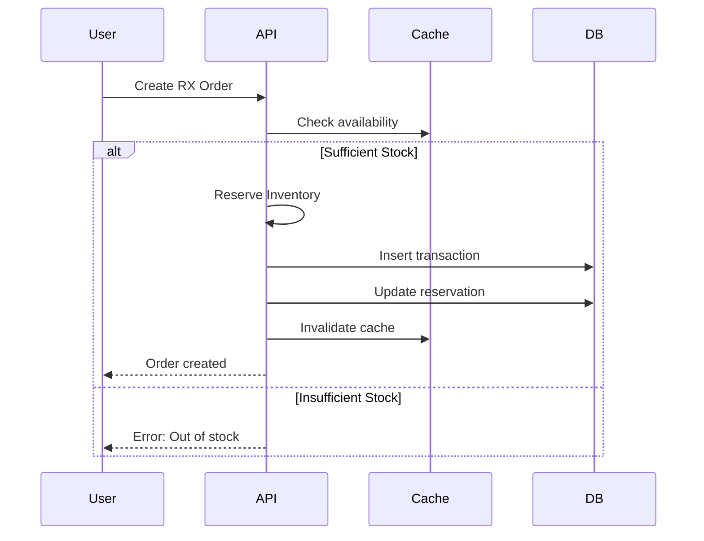
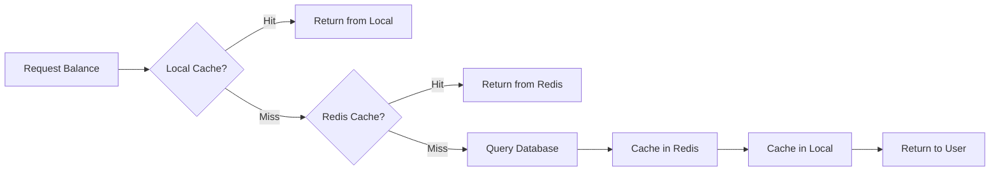

# Warehouse & Inventory API Documentation

## 🏭 Warehouse Management Endpoints

### 1. Create Warehouse
```http
POST /api/v1/warehouses
Authorization: Bearer YOUR_TOKEN
Content-Type: application/json

{
  "code": "WH001",
  "name": "انبار مرکزی",
  "financial_system_code": "FIN-WH001",
  "address": "تهران، خیابان ولیعصر",
  "is_active": true
}
```

### 2. Get Warehouse
```http
GET /api/v1/warehouses/{id}
Authorization: Bearer YOUR_TOKEN
```

### 3. List Warehouses
```http
GET /api/v1/warehouses
Authorization: Bearer YOUR_TOKEN
```

### 4. Update Warehouse
```http
PUT /api/v1/warehouses/{id}
Authorization: Bearer YOUR_TOKEN
Content-Type: application/json

{
  "name": "انبار مرکزی - به‌روزرسانی شده",
  "is_active": true
}
```

---

## 📋 Warehouse Document Templates

### 1. Create Document Template
```http
POST /api/v1/warehouses/templates
Authorization: Bearer YOUR_TOKEN
Content-Type: application/json

{
  "code": "TPL-IN-001",
  "name": "رسید انبار",
  "direction": "in",
  "document_type": "purchase",
  "affects_inventory": true,
  "requires_approval": false,
  "is_active": true
}
```

**Document Types:**
- `opening` - افتتاحیه
- `purchase` - خرید
- `consumption` - مصرف
- `return` - مرجوعی
- `adjustment` - تعدیل
- `transfer` - انتقال
- `other` - سایر

**Directions:**
- `in` - ورود به انبار
- `out` - خروج از انبار

### 2. List Document Templates
```http
GET /api/v1/warehouses/templates
Authorization: Bearer YOUR_TOKEN
```

---

## 📄 Warehouse Documents

### 1. Create Warehouse Document
```http
POST /api/v1/warehouses/documents
Authorization: Bearer YOUR_TOKEN
Content-Type: application/json

{
  "document_number": "DOC-000001",
  "fiscal_year_id": 1,
  "template_id": 1,
  "warehouse_id": 1,
  "document_date": "2024-01-29",
  "supplier_id": 5,
  "reference_number": "INV-2024-001",
  "description": "خرید عدسی از تأمین‌کننده",
  "items": [
    {
      "product_id": 10,
      "unit_id": 1,
      "quantity": 100,
      "unit_price": 50000,
      "discount_percent": 5,
      "description": "عدسی 1.60"
    },
    {
      "product_id": 11,
      "unit_id": 1,
      "quantity": 50,
      "unit_price": 75000,
      "discount_percent": 10,
      "description": "عدسی 1.74"
    }
  ]
}
```

### 2. Get Document
```http
GET /api/v1/warehouses/documents/{id}
Authorization: Bearer YOUR_TOKEN
```

**Response:**
```json
{
  "id": 1,
  "document_number": "DOC-000001",
  "fiscal_year_id": 1,
  "template": {
    "id": 1,
    "code": "TPL-IN-001",
    "name": "رسید انبار",
    "direction": "in"
  },
  "warehouse": {
    "id": 1,
    "code": "WH001",
    "name": "انبار مرکزی"
  },
  "document_date": "2024-01-29T00:00:00Z",
  "supplier": {...},
  "status": "draft",
  "total_amount": 8275000,
  "items": [
    {
      "id": 1,
      "line_number": 1,
      "product": {...},
      "quantity": 100,
      "unit_price": 50000,
      "total_price": 5000000,
      "discount_percent": 5,
      "discount_amount": 250000,
      "net_amount": 4750000
    }
  ],
  "created_at": "2024-01-29T10:00:00Z"
}
```

### 3. List Documents
```http
POST /api/v1/warehouses/documents/list
Authorization: Bearer YOUR_TOKEN
Content-Type: application/json

{
  "warehouse_id": 1,
  "status": "draft",
  "from_date": "2024-01-01",
  "to_date": "2024-01-31",
  "page": 1,
  "page_size": 20
}
```

### 4. Post Document (Affect Inventory)
```http
POST /api/v1/warehouses/documents/post
Authorization: Bearer YOUR_TOKEN
Content-Type: application/json

{
  "document_id": 1
}
```

**نکته:** پس از Post کردن، موجودی انبار به‌روزرسانی می‌شود و تراکنش‌های موجودی ثبت می‌شوند.

### 5. Get Next Document Number
```http
GET /api/v1/warehouses/documents/next-number?fiscal_year_id=1
Authorization: Bearer YOUR_TOKEN
```

**Response:**
```json
{
  "next_number": 42,
  "suggested_number": "DOC-000042"
}
```

---

## 📦 Inventory Management Endpoints

### 1. Get Inventory Balance
```http
GET /api/v1/inventory/balance?warehouse_id=1&product_id=10&unit_id=1
Authorization: Bearer YOUR_TOKEN
```

**Response:**
```json
{
  "id": 1,
  "warehouse_id": 1,
  "warehouse_name": "انبار مرکزی",
  "product_id": 10,
  "product_code": "RX001",
  "product_name": "E.C.M Bifocal 1.60",
  "unit_id": 1,
  "unit_name": "عدد",
  "quantity_on_hand": 100,
  "quantity_reserved": 20,
  "quantity_available": 80,
  "last_updated": "2024-01-29T10:00:00Z"
}
```

**نکته:** این endpoint از Redis Cache استفاده می‌کند برای سرعت بالا.

### 2. List Inventory Balances
```http
POST /api/v1/inventory/balances
Authorization: Bearer YOUR_TOKEN
Content-Type: application/json

{
  "warehouse_id": 1,
  "search": "1.60",
  "page": 1,
  "page_size": 50
}
```

### 3. Get Bulk Balances
```http
POST /api/v1/inventory/bulk-balances
Authorization: Bearer YOUR_TOKEN
Content-Type: application/json

{
  "warehouse_id": 1,
  "product_ids": [10, 11, 12, 13, 14]
}
```

**Response:**
```json
{
  "balances": {
    "10": 80.0,
    "11": 45.5,
    "12": 0.0,
    "13": 120.0,
    "14": 67.5
  }
}
```

**استفاده:** برای چک کردن سریع موجودی چند محصول به صورت همزمان (مفید برای سفارش‌گیری).

### 4. Reserve Inventory
```http
POST /api/v1/inventory/reserve
Authorization: Bearer YOUR_TOKEN
Content-Type: application/json

{
  "warehouse_id": 1,
  "product_id": 10,
  "quantity": 10,
  "reference_type": "rx_order",
  "reference_id": 100
}
```

**نکته:** 
- موجودی را رزرو می‌کند برای یک سفارش
- quantity_available کم می‌شود ولی quantity_reserved زیاد می‌شود
- Cache خودکار invalidate می‌شود

### 5. Release Inventory
```http
POST /api/v1/inventory/release
Authorization: Bearer YOUR_TOKEN
Content-Type: application/json

{
  "warehouse_id": 1,
  "product_id": 10,
  "quantity": 5,
  "reference_type": "rx_order",
  "reference_id": 100
}
```

**استفاده:** زمانی که سفارش کنسل می‌شود یا بخشی از رزرو آزاد می‌شود.

### 6. Adjust Inventory (Manual)
```http
POST /api/v1/inventory/adjust
Authorization: Bearer YOUR_TOKEN
Content-Type: application/json

{
  "warehouse_id": 1,
  "product_id": 10,
  "unit_id": 1,
  "quantity_change": 5,
  "transaction_type": "adjustment",
  "description": "تعدیل موجودی به دلیل اشتباه در شمارش"
}
```

**Transaction Types:**
- `adjustment` - تعدیل
- `opening` - موجودی اولیه
- `consumption` - مصرف
- `return` - برگشتی
- `reservation` - رزرو
- `release` - آزادسازی

### 7. List Inventory Transactions
```http
POST /api/v1/inventory/transactions
Authorization: Bearer YOUR_TOKEN
Content-Type: application/json

{
  "warehouse_id": 1,
  "product_id": 10,
  "from_date": "2024-01-01T00:00:00Z",
  "to_date": "2024-01-31T23:59:59Z",
  "page": 1,
  "page_size": 50
}
```

**Response:**
```json
{
  "data": [
    {
      "id": 1,
      "transaction_date": "2024-01-29T10:00:00Z",
      "warehouse_id": 1,
      "warehouse_name": "انبار مرکزی",
      "product_id": 10,
      "product_code": "RX001",
      "product_name": "E.C.M Bifocal 1.60",
      "unit_id": 1,
      "quantity_change": 100,
      "transaction_type": "purchase",
      "reference_type": "warehouse_document",
      "reference_id": 1,
      "balance_after": 100,
      "description": "Document #DOC-000001"
    }
  ],
  "pagination": {...}
}
```

### 8. Get Inventory Summary
```http
GET /api/v1/inventory/summary/{warehouseId}
Authorization: Bearer YOUR_TOKEN
```

**Response:**
```json
{
  "warehouse_id": 1,
  "warehouse_name": "انبار مرکزی",
  "total_products": 150,
  "total_quantity": 15000,
  "out_of_stock_products": 5
}
```

### 9. Invalidate Cache
```http
DELETE /api/v1/inventory/cache?warehouse_id=1&product_id=10
Authorization: Bearer YOUR_TOKEN
```

**Query Parameters:**
- `warehouse_id` (optional) - اگر مشخص شود، فقط کش این انبار پاک می‌شود
- `product_id` (optional) - اگر مشخص شود، فقط کش این محصول پاک می‌شود
- اگر هیچکدام مشخص نشود، تمام کش پاک می‌شود

---

## 🔥 Important Workflows

### Workflow 1: Purchase Entry (ورود خرید)



**Steps:**
1. Create warehouse document with items
2. Review document
3. Post document → affects inventory
4. Cache automatically invalidated
5. Inventory balances updated via database trigger

### Workflow 2: Order Reservation (رزرو برای سفارش)



### Workflow 3: Cache Strategy



**Cache Layers:**
1. **Local Cache** (1 min TTL) - Fastest
2. **Redis Cache** (5 min TTL) - Shared across instances
3. **Database** - Source of truth

---

## ⚡ Performance Features

### 1. Multi-Layer Caching
- Local in-memory cache برای سرعت بالا
- Redis برای sharing بین instances
- خودکار invalidation هنگام تغییر

### 2. Bulk Operations
- دریافت موجودی چند محصول یکجا
- کاهش تعداد query به database

### 3. Transaction Management
- تمام عملیات موجودی در transaction
- Rollback خودکار در صورت خطا
- Audit trail کامل

### 4. Trigger-based Updates
- inventory_balances به‌روزرسانی خودکار
- محاسبه balance_after در تراکنش‌ها
- تضمین consistency

---

## 🧪 Testing Examples

### Test 1: Complete Purchase Flow
```bash
# 1. Create document
curl -X POST http://localhost:8080/api/v1/warehouses/documents \
  -H "Authorization: Bearer $TOKEN" \
  -H "Content-Type: application/json" \
  -d '{
    "document_number": "DOC-000001",
    "fiscal_year_id": 1,
    "template_id": 1,
    "warehouse_id": 1,
    "document_date": "2024-01-29",
    "items": [
      {
        "product_id": 10,
        "unit_id": 1,
        "quantity": 100,
        "unit_price": 50000
      }
    ]
  }'

# 2. Post document
curl -X POST http://localhost:8080/api/v1/warehouses/documents/post \
  -H "Authorization: Bearer $TOKEN" \
  -H "Content-Type: application/json" \
  -d '{"document_id": 1}'

# 3. Check balance
curl -X GET "http://localhost:8080/api/v1/inventory/balance?warehouse_id=1&product_id=10&unit_id=1" \
  -H "Authorization: Bearer $TOKEN"
```

### Test 2: Reservation Flow
```bash
# 1. Check availability
curl -X GET "http://localhost:8080/api/v1/inventory/balance?warehouse_id=1&product_id=10" \
  -H "Authorization: Bearer $TOKEN"

# 2. Reserve
curl -X POST http://localhost:8080/api/v1/inventory/reserve \
  -H "Authorization: Bearer $TOKEN" \
  -H "Content-Type: application/json" \
  -d '{
    "warehouse_id": 1,
    "product_id": 10,
    "quantity": 10,
    "reference_type": "rx_order",
    "reference_id": 100
  }'

# 3. Check again (available should be reduced)
curl -X GET "http://localhost:8080/api/v1/inventory/balance?warehouse_id=1&product_id=10" \
  -H "Authorization: Bearer $TOKEN"
```

---

## 📊 Database Triggers

### inventory_balance_update_trigger
این trigger خودکار موجودی را محاسبه می‌کند:

```sql
-- Automatically updates inventory_balances when transactions are inserted
CREATE OR REPLACE FUNCTION update_inventory_balance()
RETURNS TRIGGER AS $$
BEGIN
    -- Update or insert balance
    INSERT INTO inventory_balances (
        warehouse_id, product_id, unit_id,
        quantity_on_hand, quantity_reserved, quantity_available, last_updated
    )
    VALUES (
        NEW.warehouse_id, NEW.product_id, NEW.unit_id,
        NEW.quantity_change, 0, NEW.quantity_change, CURRENT_TIMESTAMP
    )
    ON CONFLICT (warehouse_id, product_id, unit_id)
    DO UPDATE SET
        quantity_on_hand = inventory_balances.quantity_on_hand + NEW.quantity_change,
        quantity_available = inventory_balances.quantity_available + NEW.quantity_change,
        last_updated = CURRENT_TIMESTAMP;
    
    RETURN NEW;
END;
$$ LANGUAGE plpgsql;
```

---

## 🎯 Best Practices

### 1. Always Use Transactions
```go
tx, _ := db.Begin(ctx)
defer tx.Rollback(ctx)

// Do operations...

tx.Commit(ctx)
```

### 2. Invalidate Cache After Changes
```go
inventoryCache.InvalidateBalance(ctx, warehouseID, productID, unitID)
```

### 3. Check Availability Before Reservation
```go
balance, _ := inventoryService.GetBalance(ctx, warehouseID, productID, unitID)
if balance.QuantityAvailable < requiredQuantity {
    return errors.NewInsufficientStockError(...)
}
```

### 4. Use Bulk Operations When Possible
```go
// Instead of multiple single requests
balances := inventoryService.GetBulkBalances(ctx, req)
```

---

## 🔒 Security Notes

- تمام endpoints نیاز به authentication دارند
- Reserve/Release/Adjust نیاز به permission مخصوص دارند
- Audit trail کامل برای تمام تراکنش‌ها
- Rate limiting روی cache invalidation

---

این مستندات برای Warehouse و Inventory کامل است و تمام قابلیت‌های پیاده‌سازی شده را پوشش می‌دهد. 🎉
